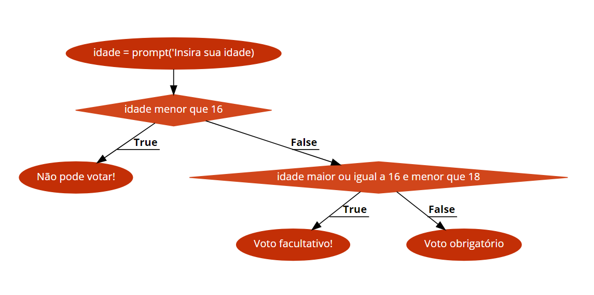

# Instruções

- Faça uma cópia deste arquivo .md para um repositório próprio
- Resolva as 6 questões objetivas assinalando a alternativa correta
- Resolva as 4 questões dissertativas escrevendo no próprio arquivo .md
  - lembre-se de utilizar as estruturas de código como ``esta aqui com ` `` ou
```javascript
//esta aqui com ```
let a = "olá"
let b = 10
print(a)
```
- Resolva as questões com uso do Visual Studio Code ou ambiente similar.
- Teste seus códigos antes de trazer a resposta para cá.
- Cuidado com ChatGPT e afins: entregar algo só para ganhar nota não faz você aprender e ficar mais inteligente. Não seja dependente da máquina! (E não se envolva em plágio!)
- ao final, publique seu arquivo lista_02.md com as respostas em seu repositório, e envie o link pela Adalove. 

# Questões objetivas

**1)** Considere o seguinte código JavaScript:

```javascript
//EX01
let x = 17
let y = 5
let z = 8

resultadoBooleano =  (x < y) && (z > x) || (x - y > z)
console.log(resultadoBooleano)

const listaDeNumeros = [1, 2, 3, 4, 5];
let soma = 0;

for (let i = 0; i < listaDeNumeros.length; i++) {
  soma += listaDeNumeros[i];
}

console.log("A soma dos números é:", soma);

```
Qual das seguintes alternativas melhor descreve o que o código faz?

A) O código avalia a expressão booleana, imprime o resultado `false`, calcula a soma dos números de 1 a 5 e imprime o resultado no console.

**B) O código avalia a expressão booleana, imprime o resultado `true`, calcula a soma dos números de 1 a 5 e imprime o resultado no console.**
**Justificativa: o booleano é retornado true por conta da condição de "||" (ou) que é colocada na variável resultadoBooleano, então caso a primeira condição seja falsa, o código seguirá para a segunda afirmação após o ||, que neste caso é verdadeira, portanto o resultado será "true" (caso tivesse && no lugar de ||, o resultado seria "false"). Para o segundo console.log(), é retornada a sima por conta do loop feito com for, que faz a soma de todos os componentes do array (i).**

C) O código avalia a expressão booleana, imprime o resultado `true` e verifica se o número 5 está presente na lista de números.

D) O código avalia a expressão booleana, imprime o resultado `false` e ordena a lista de números em ordem crescente.


______

**2)** Analise as funções calcularOrcamento() e calcularOrcamento2(). Num cenário em que a lista gastos fosse incializada como var gastos = [3600, 950, 620, 38] em ambas funções.

```javascript
//Versão 1 da função que calcula orçamento
function calculaOrcamento(){

    var gastos = [1800, 950, 620, 38];
    var totalGastos = gastos[0];
    var salario = 3500;
    var saldo = 0; 
    var statusSaldo =  'positivo';
    var i = 1;

    do{
        totalGastos += gastos[i];
        i++;
    } while(salario >= totalGastos && i<gastos.length)
    
    saldo = salario - totalGastos;

    if (saldo < 0 ){
        statusSaldo = 'negativo';
    } 
    console.log (`Seu saldo é ${statusSaldo} de ${saldo}. `);
}
```

```javascript
//Versão 2 da função que calcula orçamento
function calculaOrcamento2(){

    var gastos = [1800, 950, 620, 38];
    var totalGastos = gastos[0];
    var salario = 3500;
    var statusSaldo =  'positivo';
    var saldo = 0;
    var i = 1;

    while(salario >= totalGastos && i<gastos.length){
        totalGastos += gastos[i];
        i++;
    }

    saldo = salario - totalGastos;
    if (saldo < 0 ){
        statusSaldo = 'negativo';
    } 
    console.log (`Seu saldo é ${statusSaldo} de ${saldo}. `);
}
```

Escolha a opção que responde corretamente qual seria a saída após a execução de cada função:

A) As funções calcularOrcamento() e calcularOrcamento2() teriam a mesma saída: 'Seu saldo é negativo de -1050.'

**B) A saída de calcularOrcamento() seria: 'Seu saldo é negativo de -1050.' e a de calcularOrcamento2() seria: 'Seu saldo é negativo de -100.'**
**Justificativa: O que acontece em ambas funçõe quando o array se inicia com '3600' é que var gastos[0] já inicia maior que salário, portanto o que o código roda é apenas saldo = salario - totalGastos; e if(saldo < 0){}, portanto o que é imprimido no console é "-1050" e "-100"**

C) A saída de calcularOrcamento() seria: 'Seu saldo é negativo de -100.' e a de calcularOrcamento2() seria: 'Seu saldo é negativo de -1050.'

D) As funções calcularOrcamento() e calcularOrcamento2() teriam a mesma saída: 'Seu saldo é negativo de -100.'

______

**3)** Considere o seguinte trecho de código em JavaScript:
```javascript
//EX03
const numero = 10;

if (numero % 2 === 0) {
  console.log("O número é par!");
} else if (numero % 3 === 0) {
  console.log("O número é divisível por 3!");
} else {
  console.log("O número é ímpar e não é divisível por 3!");
}
```

Qual das seguintes alternativas é a descrição mais precisa do que o código faz?


A) O código verifica se o número é divisível por 3 e, se for, exibe a mensagem "O número é divisível por 3!".

B) O código verifica se o número é par ou ímpar. Se for par, exibe a mensagem "O número é par!". Se for ímpar, exibe a mensagem "O número é ímpar!".

C) O código verifica se o número é par, ímpar ou divisível por 3. Se for par, exibe a mensagem "O número é par!". Se for divisível por 3, exibe a mensagem "O número é divisível por 3!". Se for ímpar, exibe a mensagem "O número é ímpar e não é divisível por 3!".

**D) O código verifica se o número é par, se é divisível por 3 ou se é ímpar. Se for par, exibe a mensagem "O número é par!". Se for divisível por 3 (e não for par), exibe a mensagem "O número é divisível por 3!". Se for ímpar (e não for divisível por 3), exibe a mensagem "O número é ímpar e não é divisível por 3!".**
**Justificativa: o símbolo de porcentagem presente nas linhas 3 e 5 do código verificam se o número definido na variável é divisível por 2 e 3, o que mostra, inicialmente se o número é par e caso não seja, se é divisível por 3, caso nenhuma dessas condições sejam verdadeiras, o resultado é que o número é ímpar e não divisível por 3.**


______

**4)** Qual será o resultado impresso no console após a execução desse código?
```javascript
//EX04
var saldo = 1000;
var limiteCredito = 500;
var valorCompras = [200, 800, 300, 400, 600];

for (var i = 0; i < valorCompras.length; i++) {
    var valorCompra = valorCompras[i];

    if (valorCompra <= saldo) {
        console.log("Compra " + (i+1) + " aprovada. Saldo restante: " + (saldo - valorCompra));
        saldo -= valorCompra;
    } else if (valorCompra <= saldo + limiteCredito) {
        console.log("Compra " + (i+1) + " aprovada com limite de crédito. Saldo restante: " + ((saldo + limiteCredito) - valorCompra));
        saldo = 0;
        limiteCredito -= (valorCompra - saldo);
    } else {
        console.log("Compra " + (i+1) + " negada. Saldo insuficiente e limite de crédito excedido.");
    }
}
```

Escolha a opção que responde corretamente:

A)
Compra 1 aprovada. Saldo restante: 800

Compra 2 aprovada com limite de crédito. Saldo restante: 700

Compra 3 aprovada. Saldo restante: 400

Compra 4 aprovada com limite de crédito. Saldo restante: 0

Compra 5 aprovada. Saldo restante: -200


B)
Compra 1 aprovada. Saldo restante: 800

Compra 2 aprovada com limite de crédito. Saldo restante: 700

Compra 3 aprovada. Saldo restante: 200

Compra 4 negada. Saldo insuficiente e limite de crédito excedido.

Compra 5 negada. Saldo insuficiente e limite de crédito excedido.


C)
Compra 1 aprovada. Saldo restante: 800

Compra 2 aprovada com limite de crédito. Saldo restante: 700

Compra 3 aprovada. Saldo restante: 400

Compra 4 negada. Saldo insuficiente e limite de crédito excedido.


**D)**

**Compra 1 aprovada. Saldo restante: 800**

**Compra 2 aprovada. Saldo restante: 0**

**Compra 3 aprovada com limite de crédito. Saldo restante: 200**

**Compra 4 negada. Saldo insuficiente e limite de crédito excedido.**

**Compra 5 negada. Saldo insuficiente e limite de crédito excedido.**

**Justificativa: o loop em for com o atributo "valorCompras.length" faz com que todos os elementos da array seja executado, neste exemplo são 5 compras com valores diferentes. Todas as vezes que o loop roda, o saldo é atualizado, a compra 1 e 2 ainda são possíveis de fazer sem o uso do crédito, contudo para a terceira compra o valor de 500 reais é usado e sobram 200 reais, depois disso não é mais possível realizar nenhuma compra pois nem o saldo nem o crédito são possíveis de pagar a dívida.**

______

**5)** Qual é o principal ciclo de vida de um jogo em Phaser.js?

Escolha a opção que responde corretamente:

A) Setup -> Update -> Draw

**B) Preload -> Create -> Update**
**Justificativa: o preload carrega as imagens, sprites, etc. que serão usados em 'create', que por sua vez, mostra as imagens, sprites, etc. que foram carregadas anteriormente. Update é o código que ficará rodando continuamente no jogo.**

C) Load -> Initialize -> Render

D) Begin -> Play -> End
______

**6)** Qual é o objetivo principal do módulo Arcade Physics em Phaser.js?

Escolha a opção que responde corretamente:

A) Renderizar gráficos 3D para jogos em HTML5.

**B) Simular interações físicas realistas, como colisões e movimentos, em jogos 2D.**
**Justificativa: é possível visualizar isso pois para adicionar este atributo ao jogo, é preciso colocar nas configs do jogo com o texto "physics: 'arcade'"**

C) Criar efeitos de áudio para melhorar a experiência do usuário em jogos.

D) Gerenciar a lógica do jogo e a sincronização de eventos em jogos multiplayer.

______

# Questões dissertativas

**7)** Implemente o pseudocódigo para o algoritmo representado no fluxograma da imagem.


```javascript
// Considerei que o código seria executado sem Node.js
var idade = prompt("Coloque aqui sua idade: ")

if(idade < 16){
    console.log("Você não pode votar")
} else if (idade < 18 ) {
    console.log("Seu voto é facultativo")
} else {
    console.log("Seu voto é obrigatório")
}
```
______

**8)** Considere a implementação da classe base FormaGeometrica em um sistema de modelagem de formas geométricas. Sua tarefa é implementar, utilizando pseudocódigo, as classes derivadas Retangulo e Circulo, que herdam da classe FormaGeometrica, adicionando atributos específicos e métodos para calcular a área de um retângulo e de um círculo, respectivamente.

``` javascript
    class FormaGeometrica {
        constructor(cor){
            this.cor = cor
        }
        calcularArea() {
            let altura = 14
            let base = 14
            let area = base * altura
            console.log("A area do quadrado " + this.cor + " é " + area + " metros quadrados.")
        }
    }

    class Retangulo extends FormaGeometrica {
        calcularArea() {
            let altura = 10
            let base = 20
            let area = base * altura
            console.log("A area do retangulo " + this.cor + " é " + area + " metros quadrados.")
        }
    }

    class Circulo extends FormaGeometrica {
        calcularArea() {
            let raio = 8
            let pi = 3.14
            let area = raio * raio * pi
            console.log("A area do círculo " + this.cor + " é " + area + " metros quadrados.")
        }
    }

    new FormaGeometrica("azul").calcularArea()
    new Retangulo("verde").calcularArea()
    new Circulo("vermelho").calcularArea()
```

______

**9)** Você foi contratado(a) como estagiário(a) da Tesla e está participando do desenvolvimento de um programa para simular o desempenho de um carro elétrico em uma corrida. Seu objetivo é determinar em quantos minutos o carro levará para completar uma determinada distância, levando em consideração uma velocidade inicial e uma taxa de aceleração constante. No entanto, você deseja garantir que o carro não exceda uma velocidade máxima nem que a corrida demore mais do que um tempo máximo. Implemente a lógica dessa simulação em pseudocódigo.

``` javascript
    var velocidadeInicial = 20
    var velocidadeMax = 40
    var velocidade = velocidadeInicial;

    var aceleracao = 100

    var distanciaPercorrida = 0
    var distanciaTotal = 10

    var tempo = 0
    var tempoMax = 20

    while (distanciaPercorrida < distanciaTotal && tempo < tempoMax) {
        // Adiciona a aceleracao
        velocidade += aceleracao / 60 // Atualiza a velocidade (km/h para km/min)
        
        // Limita a velocidade
        if (velocidade > velocidadeMax) {
            velocidade = velocidadeMax
        }

        if (distanciaPercorrida < distanciaTotal) {
            // Atualiza a distância percorrida
            distanciaPercorrida += velocidade / 60 // Atualiza a distância percorrida
            tempo++ // Adiciona 1 minuto
        }
        
        console.log(`Tempo: ${tempo} min | Velocidade: ${velocidade.toFixed(2)} km/h | Distância: ${distanciaPercorrida.toFixed(2)} km`)
    }

    // Condição caso o tempo chegue no máximo
    if (distanciaPercorrida < distanciaTotal) {
        console.log(`Tempo máximo atingido! Distância percorrida: ${distanciaPercorrida.toFixed(2)} km`)
    }
```

______

**10)** Uma matriz é uma coleção bidimensional de elementos, organizados em linhas e colunas. A seguir, é fornecida a implementação da função SomaDeMatrizes(matrizA, matrizB), que calcula a soma de duas matrizes. Sua tarefa é implementar uma função semelhante, porém que realize a multiplicação de duas matrizes.

```javascript
function MultiplicacaoDeMatrizes(matrizA, matrizB) {
    // Verifica se o número de colunas de matrizA é igual ao número de linhas de matrizB
    if (matrizA[0].length !== matrizB.length) {
        return "As matrizes não podem ser multiplicadas. O número de colunas de matrizA deve ser igual ao número de linhas de matrizB.";
    } else {
        let linhasA = matrizA.length;
        let colunasA = matrizA[0].length;  // Número de colunas de matrizA
        let colunasB = matrizB[0].length;  // Número de colunas de matrizB
        let matrizResultado = [];

        // Inicializa a matriz resultado com 0s
        for (let i = 0; i < linhasA; i++) {
            matrizResultado[i] = [];
            for (let j = 0; j < colunasB; j++) {
                matrizResultado[i][j] = 0;  // Inicializa cada posição com 0
            }
        }

        // Loop para calcular a multiplicação das matrizes
        for (let i = 0; i < linhasA; i++) {
            for (let j = 0; j < colunasB; j++) {
                for (let k = 0; k < colunasA; k++) {
                    matrizResultado[i][j] += matrizA[i][k] * matrizB[k][j];
                }
            }
        }

        return matrizResultado;
    }
}

// Exemplo de uso da função
let matrizA = [[1, 2, 3], [4, 5, 6], [7, 8, 9]];
let matrizB = [[9, 8, 7], [6, 5, 4], [3, 2, 1]];

let multiplicacaoMatriz = MultiplicacaoDeMatrizes(matrizA, matrizB);

console.log("Multiplicação das matrizes:");
console.log(multiplicacaoMatriz);
```